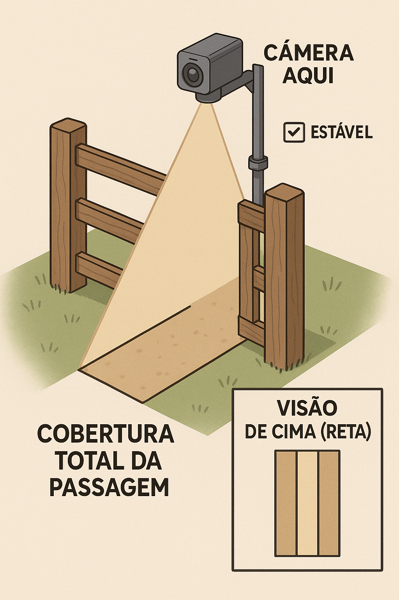

# CountGFront

## Project Description / Descrição do Projeto
### English
CountGFront is the mobile interface for the CountG project. Built with React Native and Expo, the app connects to a FastAPI backend that runs YOLO models to count objects in images or video streams.
### Português
CountGFront é a interface móvel do projeto CountG. Construído com React Native e Expo, o aplicativo se conecta a um backend FastAPI que executa modelos YOLO para contar objetos em imagens ou fluxos de vídeo.

## Features / Funcionalidades
### English
- React Native + Expo based UI.
- Capture photos or pick files for counting.
- Communicates with a FastAPI backend for training and detection.
- Support for Ngrok when local IP is not accessible.
### Português
- Interface baseada em React Native + Expo.
- Captura fotos ou seleciona arquivos para contagem.
- Comunicação com backend FastAPI para treinamento e detecção.
- Suporte a Ngrok quando o IP local não está acessível.

## Installation / Instalação
### English
1. **Backend (optional)**  
   ```bash
   cd CountG
   python3.10 -m venv venv
   source venv/bin/activate            # Windows: venv\\Scripts\\activate
   pip install -r requirements.txt
   uvicorn main:app --host 0.0.0.0 --port 8000
   ```
2. **Frontend**  
   ```bash
   cd CountGFront
   npm install
   ```
### Português
1. **Backend (opcional)**  
   ```bash
   cd CountG
   py -3.10 -m venv venv
   venv\\Scripts\\activate
   pip install -r requirements.txt
   uvicorn main:app --host 0.0.0.0 --port 8000
   ```
2. **Frontend**  
   ```bash
   cd CountGFront
   npm install
   ```

## Usage / Uso
### English
1. Start the Expo server:
   ```bash
   npx expo start
   ```
2. In the Expo terminal press `d` and select **LAN** for local network access.
3. If the device cannot reach your local IP, use Ngrok:
   ```bash
   ngrok http 8000
   ```
   Use the generated URL in the app configuration.
### Português
1. Inicie o servidor Expo:
   ```bash
   npx expo start
   ```
2. No terminal do Expo pressione `d` e selecione **LAN** para acesso pela rede local.
3. Se o dispositivo não alcançar seu IP local, use o Ngrok:
   ```bash
   ngrok http 8000
   ```
   Utilize a URL gerada na configuração do aplicativo.

## Screenshots / Capturas de Tela



## Contribution Guidelines / Guia de Contribuição
### English
1. Fork the repository.
2. Create a feature branch: `git checkout -b my-feature`.
3. Commit your changes and push to your branch.
4. Open a Pull Request.

### Português
1. Faça um fork do repositório.
2. Crie uma branch: `git checkout -b minha-funcionalidade`.
3. Faça commit das alterações e envie para sua branch.
4. Abra um Pull Request.
